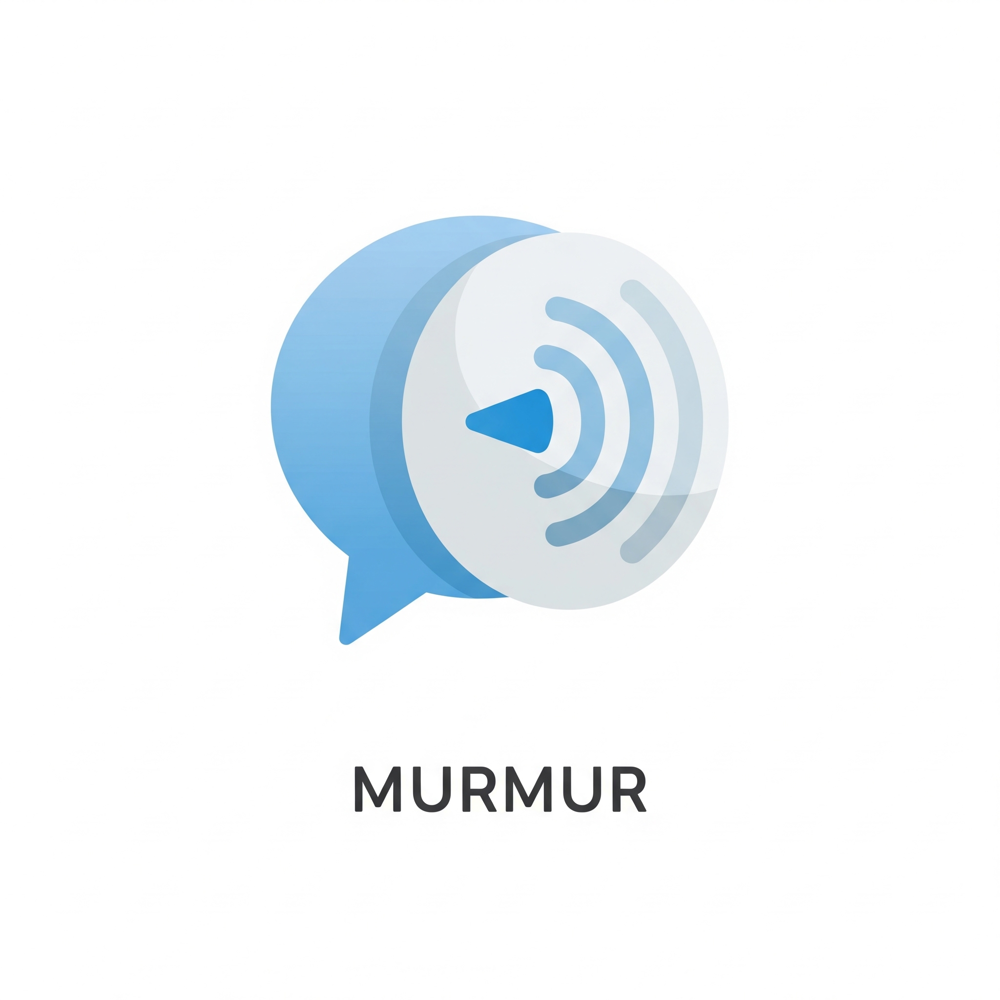

<p align="center">
  
</p>

# Murmur

Privacy-first BYOK (Bring Your Own Key) voice typing application built with native Swift and SwiftUI.

## Features

- Real-time speech-to-text with multiple providers (Apple, ElevenLabs, OpenAI, Groq)
- Apple STT: on-device speech recognition via macOS — no API key needed
- LLM post-processing with multiple providers: Apple Foundation Models (on-device), OpenAI GPT, Claude, Gemini API, Custom OpenAI-compatible (Ollama, LM Studio, vLLM), or CLI tools (gemini-cli, copilot-cli)
- Transcription history with search, copy, and persistent storage
- Voice commands (shorten, translate, change tone, generate reply)
- Personal dictionary for custom terms and aliases
- macOS floating overlay window with glassmorphism UI
- Audio cues for state feedback (recording start/stop, errors)
- System tray integration with dynamic menu
- Global hotkey support (configurable, default Ctrl+`)
- Auto-opens settings on first launch for easy onboarding
- Complete privacy — all data goes directly to your chosen providers
- Comprehensive permissions handling for microphone and accessibility

## Project Structure

```
murmur-swift/
├── MurmurKit/                        # Swift Package (zero dependencies)
│   ├── Package.swift
│   ├── Sources/
│   │   ├── Audio/                    # AudioCaptureService, AudioResampler, VadProcessor
│   │   ├── Config/                   # ConfigManager, HistoryStore
│   │   ├── Domain/                   # AppConfig, protocols, domain types
│   │   ├── LLM/                      # AppleLlm, OpenAI, Claude, GeminiApi, CustomOpenAI, Gemini/Copilot CLI, HttpLlmClient, PromptManager
│   │   ├── Output/                   # Clipboard, Keyboard, Combined output sinks
│   │   ├── Pipeline/                 # PipelineOrchestrator, VoiceCommandDetector
│   │   └── STT/                      # Apple/ElevenLabs/OpenAI/Groq providers, AudioChunker
│   └── Tests/
│       ├── AudioTests/               # AudioChunker WAV encoding tests
│       ├── ConfigTests/              # ConfigManager + HistoryStore tests
│       ├── DomainTests/              # AppConfig, VoiceCommandDetector, PersonalDictionary tests
│       └── LLMTests/                 # HttpLlmClient response parsing + auth tests
├── MurmurApp/                        # Xcode project
│   ├── Shared/
│   │   ├── MurmurApp.swift           # App entry point
│   │   ├── ViewModels/               # Pipeline, Settings, History view models
│   │   └── Views/                    # SettingsPanel, HistoryView, TranscriptionView, Waveform
│   ├── macOS/                        # OverlayWindow, SystemTray, GlobalHotkey, Permissions, Sound
│   ├── iOS/                          # (future)
│   └── Resources/                    # Info.plist, entitlements
├── Murmur.xcodeproj
└── prompts/                          # LLM prompt templates (post_process, shorten, translate, etc.)
```

## Development

### Prerequisites

- Xcode 26+
- macOS 26+

### Build & Run

```bash
# Build the Swift package
cd MurmurKit && swift build

# Run all tests (41 tests, 7 suites)
cd MurmurKit && swift test

# Build the full app via Xcode
xcodebuild -workspace Murmur.xcworkspace -scheme Murmur -configuration Release build
```

### Configuration

User configuration is stored at:
- macOS: `~/Library/Application Support/com.hydai.Murmur/config.json`

## Architecture

Murmur (Swift) is a native rebuild of the [Tauri/Rust version](https://github.com/hydai/murmur), taking full advantage of Apple's platform frameworks:

- **No FFI bridges** — Apple STT uses `SpeechTranscriber` directly (vs. Swift FFI in the Rust version)
- **No FFI bridges for LLM** — Apple Foundation Models use `LanguageModelSession` directly
- **Native concurrency** — Swift actors, `AsyncStream`, and structured concurrency replace Tokio channels
- **`@Observable` macro** — SwiftUI reactivity without `ObservableObject`/`@Published` boilerplate
- **Zero external dependencies** — MurmurKit has no third-party packages

### Domain Types

**STT (Speech-to-Text)**
- `SttProvider` protocol: Unified interface for streaming STT
- `TranscriptionEvent`: Partial/Committed/Error events
- `AudioChunk`: PCM audio data wrapper
- Apple STT: on-device speech recognition via `SpeechTranscriber`

**LLM Processing**
- `LlmProcessor` protocol: Text post-processing via cloud APIs (OpenAI, Claude, Gemini), local servers (Ollama), CLI tools, or Apple Foundation Models
- `ProcessingTask`: PostProcess/Shorten/ChangeTone/GenerateReply/Translate
- `ProcessingOutput`: Processed text with metadata

**Configuration**
- `AppConfig`: JSON-based configuration (API keys, providers, hotkeys, UI preferences)
- `PersonalDictionary`: Custom terms and aliases

**Output**
- `OutputSink` protocol: Abstract output destination
- `OutputMode`: Clipboard/Keyboard/Both

## Known Limitations

1. **LLM Provider Setup**: LLM post-processing supports multiple providers — cloud APIs (OpenAI, Claude, Gemini), local servers via Custom OpenAI-compatible endpoints (Ollama, LM Studio, vLLM), CLI tools (gemini-cli, copilot-cli), or Apple Foundation Models (on-device, no API key). If no LLM provider is configured, the app outputs raw transcriptions without post-processing.

2. **API Keys Required**: You must provide your own API keys for cloud STT providers (ElevenLabs, OpenAI, or Groq). Apple STT is a free on-device alternative that requires no API key.

3. **Apple STT**: Requires macOS 26+ for downloading speech recognition models on-device.

## License

Licensed under the Apache License, Version 2.0. See [LICENSE](LICENSE) for details.
