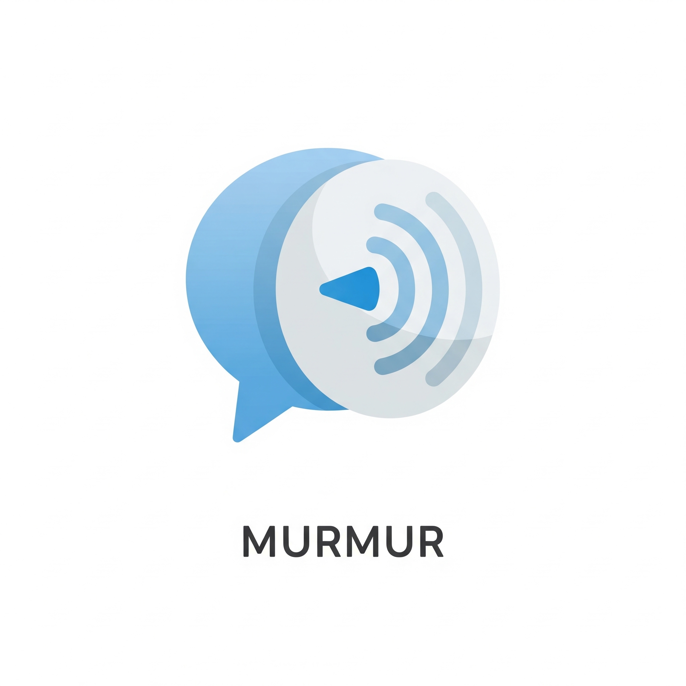

<p align="center">
  
</p>

# Murmur

Privacy-first BYOK (Bring Your Own Key) voice typing application built with native Swift and SwiftUI.

## Features

### Speech-to-Text
- **Apple Speech** (on-device, no API key) via `SpeechTranscriber`
- **WhisperKit** (on-device, no API key) via Argmax Open-Source SDK, with realtime partials, shared native runtime reuse, proactive model loading, and cache management
- **ElevenLabs Scribe v2** realtime WebSocket (98 languages, ISO 639-3)
- **OpenAI Whisper** REST batching (4 s chunks)
- **Groq Whisper Turbo** REST batching (4 s chunks)
- **Custom OpenAI-compatible** STT (Whisper.cpp, Faster Whisper, LocalAI…)

### LLM Post-Processing
- **Apple Foundation Models** (on-device, no API key)
- **OpenAI API** (`gpt-4o-mini` default, overridable)
- **Anthropic Claude API** (`claude-sonnet-4-20250514` default)
- **Google Gemini API** (`gemini-2.0-flash` default)
- **Custom OpenAI-compatible** endpoint (Ollama, LM Studio, vLLM, Azure OpenAI…)
- **Gemini CLI** (`gemini-3-flash-preview` default)
- **Copilot CLI** (`gpt-5-mini` default)
- **Runtime-editable prompt templates** — five built-in prompts (post-process, shorten, change tone, translate, generate reply) with a Settings editor that saves overrides to `~/Library/Application Support/com.hydai.Murmur/prompts/`
- **Voice commands** — `shorten:`, `make it formal:`, `make it casual:`, `reply to:`, `translate to {language}:`
- **Personal dictionary** for custom terms with optional aliases and descriptions
- Live LLM/output/dictionary hot-swap — change settings mid-session and the next recording (or its post-processing) uses the new value

### Interface
- macOS floating glassmorphism overlay with waveform indicator
- Audio cues for state feedback (start, stop, error)
- System tray with Start/Stop, Settings, History, Check for Updates, and Quit
- Configurable global hotkey with live keystroke capture (default `Ctrl+\``)
- Auto-opens Settings on first launch
- **Redesigned Settings panel** with sidebar navigation, 8 sections (General, Speech-to-Text, LLM Processor, Output, Hotkey, Dictionary, Prompts, About) and reusable design tokens
- Apple Speech model status + in-Settings download with progress bar
- WhisperKit model picker + cache status/delete/open, local folder picker/validation, and in-Settings preload with download progress

### History
- Transcription history with search (300 ms debounce)
- Lazy pagination (50 entries per page)
- Relative timestamps ("Today 14:30", "Yesterday 22:00", "3d ago", absolute date)
- Cap at 500 entries with automatic pruning

### Distribution & Updates
- **Sparkle 2 auto-update** with EdDSA-signed appcast
- DMG installer with optional code signing and notarization
- Homebrew cask publish (`brew install hydai/murmur-swift/murmur-swift` once the tap is live)

### Privacy
- BYOK — your audio and transcripts go directly to the providers you configure
- On-device alternatives for both STT (Apple Speech) and LLM (Apple Foundation Models)
- No telemetry

## Project Structure

```
murmur-swift/
├── MurmurKit/                        # Swift Package (Argmax WhisperKit dependency)
│   ├── Package.swift
│   ├── Sources/
│   │   ├── Audio/                    # AudioCaptureService, AudioResampler, VadProcessor
│   │   ├── Config/                   # ConfigManager, HistoryStore, RelativeTimestampFormatter
│   │   ├── Domain/                   # AppConfig, protocols, HotkeySpec, ProviderDefaults, Notifications
│   │   ├── LLM/                      # All 7 processors + PromptName/PromptSet/PromptStore + HttpLlmClient
│   │   ├── Output/                   # Clipboard, Keyboard, Combined output sinks
│   │   ├── Pipeline/                 # PipelineOrchestrator, TranscriptionAccumulator, VoiceCommandDetector
│   │   └── STT/                      # Apple/WhisperKit/ElevenLabs/OpenAI/Groq/Custom providers, model managers
│   └── Tests/                        # 137 tests across 23 suites (Swift Testing framework)
├── MurmurApp/                        # Xcode project
│   ├── Shared/
│   │   ├── MurmurApp.swift           # @main + AppDelegate (tray, hotkey, overlay, updates)
│   │   ├── ViewModels/               # Pipeline, Settings, History view models
│   │   └── Views/                    # TranscriptionView, HistoryView, WaveformIndicator,
│   │       └── Settings/             # NavigationSplitView sidebar + 8 section views
│   ├── macOS/                        # OverlayWindow, SystemTray, Hotkey, Permissions, Sound,
│   │                                 #   ThemeApplier, UpdateManager (Sparkle)
│   └── Resources/                    # Info.plist, entitlements
├── Murmur.xcodeproj                  # Xcode project (Sparkle package, MurmurKit local)
├── prompts/                          # Five default markdown templates (post_process, shorten, …)
├── scripts/build-dmg.sh              # DMG packaging wrapper for create-dmg
├── .github/workflows/                # CI (test + build) and release (DMG, sign, notarize, Sparkle, Homebrew)
└── .githooks/pre-commit              # lineguard + swift build + swift test before each commit
```

## Development

### Prerequisites

- Xcode 26+
- macOS 26+
- (optional) `lineguard` for pre-commit formatting checks
- (optional) `create-dmg` for local DMG packaging

### Build & Run

```bash
# Build the Swift package
cd MurmurKit && swift build

# Run all tests (137 tests, 23 suites)
cd MurmurKit && swift test

# Build the full app via Xcode
xcodebuild -workspace Murmur.xcworkspace -scheme Murmur -configuration Release build
```

### Pre-commit hook

```bash
git config core.hooksPath .githooks
```

### Configuration

User configuration is stored under `~/Library/Application Support/com.hydai.Murmur/`:

- `config.json` — `AppConfig` (providers, API keys, hotkey, output mode, dictionary…)
- `history.json` — transcription history (cap 500)
- `prompts/{name}.md` — runtime prompt overrides (one file per template)

## Architecture

Murmur (Swift) is a native rebuild of the [Tauri/Rust version](https://github.com/hydai/murmur), taking full advantage of Apple's platform frameworks:

- **No FFI bridges** — Apple STT uses `SpeechTranscriber` directly (vs. Swift FFI in the Rust version)
- **No FFI bridges for LLM** — Apple Foundation Models use `LanguageModelSession` directly
- **Native concurrency** — Swift actors, `AsyncStream`, and structured concurrency replace Tokio channels
- **`@Observable` macro** — SwiftUI reactivity without `ObservableObject`/`@Published` boilerplate
- **Small dependency surface** — Sparkle handles app updates; Argmax WhisperKit powers native on-device Whisper STT

### Domain Types

**STT (Speech-to-Text)**
- `SttProvider` protocol — streaming STT abstraction
- `TranscriptionEvent` — `.partial` / `.committed` / `.error`
- `AudioChunk` — 16 kHz mono Int16 PCM with monotonic timestamp
- `TranscriptionAccumulator` — combines partials/commits with trailing-partial fallback
- `AppleSttModelManager` — status + progress-tracked downloads via `AssetInventory`
- `WhisperKitProvider` — native in-process WhisperKit transcription with realtime partial hypotheses and final stop-time commit
- `WhisperKitRuntimeStore` — shared native WhisperKit pipeline cache with download/load/prewarm status
- `WhisperKitModelManager` — supported model catalog normalization plus selected-model cache/local-folder inventory

**LLM Processing**
- `LlmProcessor` protocol — accepts a `ProcessingTask`, returns `ProcessingOutput`
- `PromptName` / `PromptSet` / `PromptStore` — five named templates with disk-backed overrides
- `PromptManager` — substitutes `{dictionary_terms}`, `{tone}`, `{language}` placeholders
- `ProviderDefaults` — single source of truth for default models per provider

**Configuration & State**
- `AppConfig` — JSON-persisted, snake_case keys, backwards-compatible decoder
- `PersonalDictionary` — entries (term + alias + description) plus legacy term list
- `HotkeySpec` — parsed `"Cmd+Shift+Space"`-style accelerators with platform-neutral modifiers
- `RelativeTimestampFormatter` — `"Today HH:mm"` / `"Yesterday HH:mm"` / `"Nd ago"` / absolute

**Output**
- `OutputSink` protocol
- `CombinedOutput(mode:)` routes to clipboard, keyboard simulation, or both

## Distribution

See `DISTRIBUTION.md` for the release process: DMG packaging via `scripts/build-dmg.sh`, optional signing and notarization on the release workflow, Sparkle appcast generation, and the Homebrew cask publish flow.

## Known Limitations

1. **API Keys Required** for cloud STT providers (ElevenLabs, OpenAI, Groq). Apple Speech and WhisperKit run on-device with no key.
2. **Apple Speech requires macOS 26+** so the on-device model can be downloaded.
3. **WhisperKit realtime partial latency depends on model size and device speed**. Settings can preload the model, but the first load on a fresh system can still take longer.
4. **Sparkle** requires `SUPublicEDKey` in `Info.plist`; without it the in-app updater shows a one-time configuration alert.

## License

Licensed under the Apache License, Version 2.0. See [LICENSE](LICENSE) for details.
